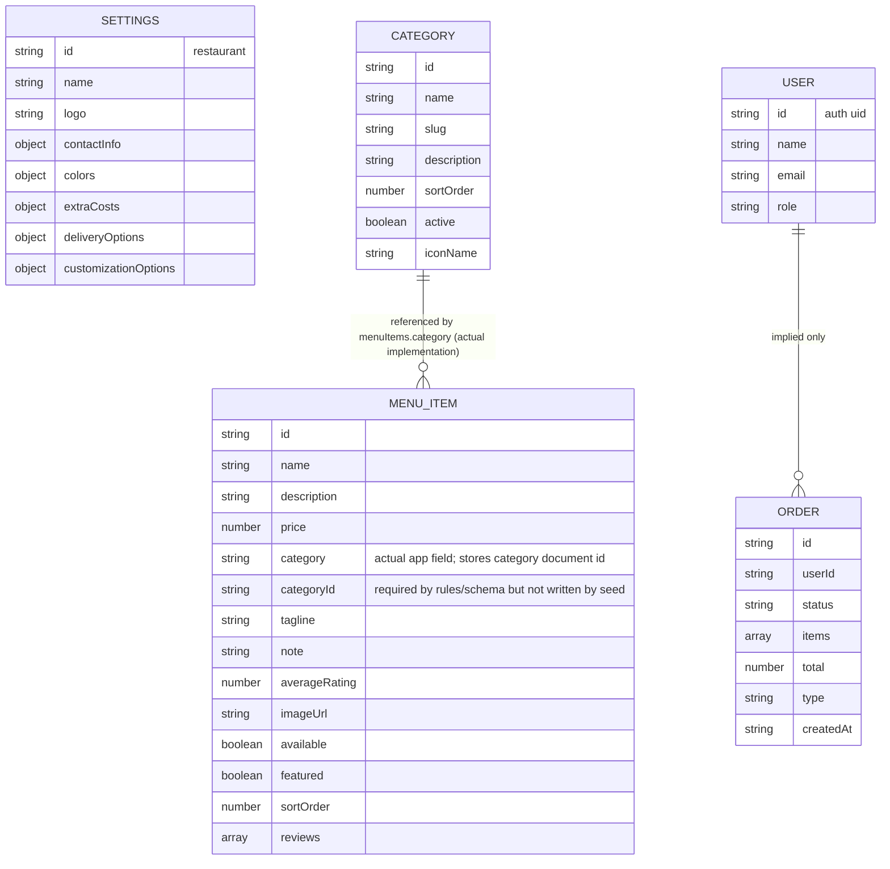
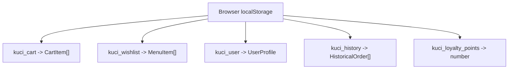

# Database Schema

## Overview

The implemented backend storage is Cloud Firestore. The frontend actively reads three datasets:

- `settings/restaurant`
- `categories`
- `menuItems`

The repository also implies two additional collections:

- `users`
- `orders`

However, neither is fully implemented in the frontend flow. The app also relies heavily on browser `localStorage` for user/session data that is not persisted server-side.

Key source files:

- `types.ts`
- `hooks/useFirestore.ts`
- `lib/seed.ts`
- `lib/seedData.ts`
- `firestore.rules`
- `firebase-blueprint.json`
- `functions/src/index.ts`

## Firestore Schema Diagram

## Collection Details

### `settings/restaurant`

Read in:

- `hooks/useFirestore.ts`
- `App.tsx`
- `views/OrdersView.tsx`
- `views/InfoView.tsx`

Written in:

- `lib/seed.ts`

Actual typed shape in `types.ts`:

- `name`
- `logo?`
- `contactInfo.phone`
- `contactInfo.whatsapp`
- `contactInfo.location`
- `contactInfo.mapLink`
- `contactInfo.contactPerson`
- `contactInfo.paybill`
- `contactInfo.vendor`
- `colors.primary`
- `colors.text`
- `colors.bg`
- `colors.bgSecondary`
- `extraCosts.topping`
- `extraCosts.otherExtra`
- `deliveryOptions`
- `customizationOptions`

Read but never typed/written consistently:

- `settings.tagline`
- `settings.contact.hours`
- `settings.contact.*`

Schema issue:

- The UI reads `settings.contact.*`, but `types.ts`, `seedData.ts`, and `firestore.rules` define `contactInfo`.

### `categories`

Read in:

- `hooks/useFirestore.ts`
- `views/HomeView.tsx`
- `views/MenuView.tsx`
- `views/BakeryView.tsx`

Written in:

- `lib/seed.ts`

Fields:

- `id` (doc ID)
- `name`
- `slug`
- `description?`
- `sortOrder?`
- `active`
- `iconName?`

Relationship:

- `menuItems.category` stores the corresponding category document ID in the actual frontend flow.

### `menuItems`

Read in:

- `hooks/useFirestore.ts`
- `views/HomeView.tsx`
- `views/MenuView.tsx`
- `views/BakeryView.tsx`
- `components/CustomizerModal.tsx`

Written in:

- `lib/seed.ts`

Fields used by the app:

- `id` (doc ID)
- `name`
- `description`
- `price`
- `category` (actual field used by app; contains category document ID)
- `tagline?`
- `note?`
- `reviews?`
- `averageRating?`
- `imageUrl?`
- `available`
- `featured?`
- `sortOrder?`

Schema issue:

- Firestore rules and blueprint require `categoryId`, but seed writes `category`.
- The app reads `item.category` as a string and treats it as a category ID in some places and a category name in others.

### `users` (implied)

Defined in:

- `firestore.rules`

Not created/read/written by the frontend app.

Implied fields:

- `name`
- `email`
- `role`

Current usage:

- Rules check `users/{uid}.role` in `isAdmin()`
- Frontend does not create user records after sign-in

### `orders` (implied)

Referenced in:

- `functions/src/index.ts`

Not written by the frontend app.

Current status:

- Cloud Function `onOrderCreated` assumes this collection exists
- Customer checkout instead stores `HistoricalOrder` locally and opens WhatsApp

## Local Storage Schema

The app persists several client-only datasets outside Firestore:

These are written in `App.tsx` and read back on app startup.

## Fields Written But Never Read

- `settings.contactInfo.contactPerson`
  Seeded/typed but not used by the UI.
- `categories.description`
  Supported by schema but not used in any visible flow.
- `menuItems.imageUrl`
  Present in type/schema but the UI uses hardcoded Unsplash selection logic instead.
- Large portions of static `MENU_ITEMS` in `constants.tsx`
  Maintained as code data but not used by the Firestore-based app runtime.

## Fields Read But Never Written

- `settings.tagline`
  Read in `views/InfoView.tsx` but absent from `RestaurantSettings` and seed data.
- `settings.contact.hours`
  Read in `views/InfoView.tsx` but absent from types and seed data.
- `settings.contact.*`
  Read in `views/InfoView.tsx` and `views/OrdersView.tsx`, but current schema writes `contactInfo.*`.
- `users/{uid}`
  Required by rules for role logic, but no frontend write path creates those documents.
- `orders/{orderId}`
  Read by Cloud Functions but never created by the frontend.

## Likely Missing Fields

These are likely intended but not implemented consistently:

- `settings.tagline`
- `settings.contactInfo.hours`
- `orders.status`
- `orders.createdAt`
- `orders.customerName`
- `orders.customerPhone`
- `orders.deliveryArea`
- `orders.deliveryFee`
- `menuItems.categoryName` or a normalized category mapping strategy

## Computed / Derived Fields

- `productSubtotal`
  Computed in `views/OrdersView.tsx`
- `deliveryFee`
  Computed in `views/OrdersView.tsx`
- `discount`
  Derived from local loyalty points in `views/OrdersView.tsx`
- `total`
  Computed in `views/OrdersView.tsx`
- `earnedPoints`
  Computed in `views/OrdersView.tsx`
- `averageRating`
  Stored on menu items, but there is no code that recalculates it from reviews

## Integrity Risks

- Category foreign key mismatch:
  Rules require `categoryId`, but data writes use `category`.
- Settings shape mismatch:
  UI assumes `contact`, schema uses `contactInfo`.
- Order persistence gap:
  Customer-visible order completion does not create a backend record.
- User role gap:
  Rules depend on `users/{uid}` docs, but the app does not manage them.
- Local-only history/loyalty:
  Order history and points are device-specific, not account-based.
- Review data inconsistency:
  Reviews are displayed from menu items but cannot be created by the UI.

## Assumptions

- `menuItems.category` is intended to act as a foreign key to `categories.id` in the current frontend.
- `orders` is a planned Firestore collection rather than a removed feature.
- `users` is intended for admin/user roles but is unfinished.

## Known Gaps / Unclear Areas

- It is unclear whether Firestore rules are actively enforced in production with the current seed flow, because the seed writes appear incompatible with the documented menu item schema.
- It is unclear whether the static `constants.tsx` menu data is legacy seed material or a fallback dataset that was abandoned.
- It is unclear whether `settings.tagline` and `hours` were intentionally omitted from `types.ts` or simply not migrated.

## Recommended Improvements

- Normalize the menu item category reference and pick one field name: `categoryId` or `category`.
- Align Firestore rules, schema docs, seed code, and frontend types.
- Add user document creation on first sign-in if role checks are expected.
- Introduce a real `orders` collection if Cloud Functions are meant to process orders.
- Move local-only business data like loyalty/history to backend storage if cross-device behavior matters.
