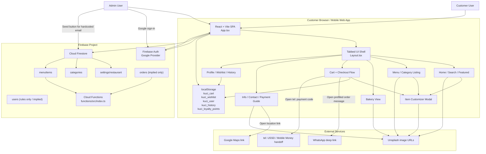

# System Architecture

## Overview

This repository contains one customer-facing React application and one Firebase Functions project. There is no separate admin panel. Administrative behavior is limited to Google sign-in plus a conditional "Seed Data" button shown inside the same frontend for one hardcoded email.

The live product architecture is centered around:

- A single Vite/React frontend
- Firebase Authentication for Google sign-in
- Cloud Firestore for menu/settings/category data
- Browser `localStorage` for cart, profile, wishlist, loyalty points, and order history
- External handoff to WhatsApp, Google Maps, and phone-based MoMo USSD
- Placeholder Firebase Functions that are not currently connected to the frontend order flow

Key source files:

- `App.tsx`
- `hooks/useFirestore.ts`
- `lib/firebase.ts`
- `components/Auth.tsx`
- `components/SeedButton.tsx`
- `views/OrdersView.tsx`
- `functions/src/index.ts`

## Architecture Diagram

## Diagram Explanation

### Frontend

The product is a single-page React app with manual tab/view switching, not route-based navigation. `App.tsx` owns the top-level UI state and decides which view to render based on `activeTab`.

### User roles

- Customer user
  Uses the main menu, customization, cart, profile, and contact flows.
- Admin user
  Uses the same app UI, signs in with Google, and if the email matches `fredkenogo@gmail.com`, sees the `SeedButton`.

There is no separate staff portal, admin dashboard, or reporting interface in the repository.

### Data flow

- Menu/config content is read from Firestore using realtime listeners in `hooks/useFirestore.ts`.
- Auth state is read from Firebase Auth in `App.tsx`.
- Customer interaction state is persisted to browser `localStorage` in `App.tsx`.
- Order completion does not create a backend order; it updates local state and opens external channels from `views/OrdersView.tsx`.
- Firestore writes currently happen only through the seed flow in `lib/seed.ts`.

### Firebase services

- Auth: actively used for Google sign-in
- Firestore: actively used for menu/settings/category reads and seed writes
- Functions: present but not integrated with the current frontend order path
- Storage: configured in Firebase app config, but not used anywhere in code

### External integrations

- WhatsApp via `wa.me` links
- Mobile money via `tel:` USSD handoff
- Google Maps via an external `mapLink`
- Unsplash for static image URLs across views

## Request / Data Flow Details

### App bootstrap

1. Browser loads the React app.
2. `App.tsx` initializes local UI state and reads browser `localStorage`.
3. `onAuthStateChanged` subscribes to Firebase Auth.
4. `useRestaurantData()` subscribes to Firestore documents/collections:
   - `settings/restaurant`
   - `categories`
   - `menuItems`

### Menu browsing

1. Customer opens Home or Menu.
2. Firestore-provided categories and menu items are rendered.
3. Customer searches or selects an item.
4. Customization modal builds a `CartItem`.
5. Cart is stored in `localStorage`.

### Checkout

1. Customer opens Orders view.
2. Cart totals are computed client-side.
3. Customer enters name and phone if missing.
4. Customer either:
   - Opens a `tel:` link for MoMo instructions
   - Opens a WhatsApp deep link with a prefilled order message
5. `onOrderComplete()` writes order history and loyalty points to local state only.

### Admin seed path

1. User signs in with Google.
2. If `user.email === 'fredkenogo@gmail.com'`, the frontend shows `SeedButton`.
3. Clicking `SeedButton` runs `seedFirestore()`.
4. Seed writes:
   - `settings/restaurant`
   - `categories`
   - `menuItems`

## Assumptions

- The app is intended to be deployed as a single frontend for one merchant.
- Firestore content is assumed to be managed externally or by future admin tooling.
- `orders` and `users` collections are planned but not fully wired into the customer UI.

## Known Gaps / Unclear Areas

- No separate admin panel exists, despite admin-like capabilities being implied by Firestore rules and seeding.
- Cloud Functions listen to `orders/{orderId}` and `menuItems/{itemId}`, but the frontend never writes `orders`.
- Firebase Storage is present in config only; there is no storage upload/download path.
- The frontend expects `settings.contact.*` in multiple places, while the schema and seed data use `contactInfo.*`.
- The app behaves like a tabbed SPA rather than route-based pages; there are no React Router routes to document.
- There is no backend API layer beyond Firebase SDK usage in the client.

## Recommended Improvements

- Add a dedicated admin surface or at least isolate admin actions from the customer UI.
- Persist orders to Firestore before or alongside WhatsApp/MoMo handoff.
- Align the settings contract across frontend types, Firestore schema, rules, and seed data.
- Decide whether Firebase Functions will stay placeholder logic or become the order processing layer.
- Either remove unused Firebase services from docs/config or implement them explicitly.
