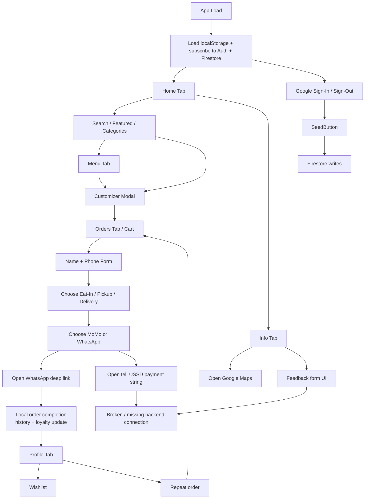

# User Flow Map

## Overview

The application is a tabbed single-page experience with no route-based navigation. User flows are controlled by `activeTab` in `App.tsx`, conditional rendering inside each view, and modal interactions for item customization.

Major implemented flows:

- Authentication
- Menu browsing and item customization
- Cart and checkout
- Profile, wishlist, and reorder
- Admin seeding

Missing or partial flows:

- Real onboarding
- Role-based admin UX
- Persisted order processing
- Feedback submission
- Review submission
- Reporting/dashboard flows

Key source files:

- `App.tsx`
- `components/Auth.tsx`
- `views/HomeView.tsx`
- `views/MenuView.tsx`
- `components/CustomizerModal.tsx`
- `views/OrdersView.tsx`
- `views/ProfileView.tsx`
- `components/SeedButton.tsx`

## Flow Diagram

## Flow Details

### 1. Authentication Flow

Entry point:

- Header auth button in `components/Layout.tsx`

Screens / actions:

1. User taps Sign In.
2. `components/Auth.tsx` starts Google popup auth.
3. `App.tsx` receives auth state via `onAuthStateChanged`.
4. If Google profile data exists, the app copies `displayName` and `photoURL` into local profile state.

Backend updates:

- Firebase Auth session only
- No user document creation in Firestore

Completion state:

- Signed-in user visible in UI
- Sign-out available

Failure points:

- No onboarding after sign-in
- No Firestore `users/{uid}` document creation
- Role logic exists in rules but not in the UI flow

### 2. Customer Browsing Flow

Entry point:

- Home tab

Screens / actions:

1. Customer lands on Home.
2. Sees hero, search, featured items, categories, and recent/recommended content.
3. Can search menu items or navigate to Menu.
4. Can favorite items or open the customizer modal.

Backend/database updates:

- None
- Favorites and cart changes are stored only in localStorage

Completion state:

- Item added to cart or saved to wishlist

Failure points:

- Home-to-menu category handoff is incomplete in `App.tsx`
- Search works, but category-specific navigation is not fully wired

### 3. Item Customization Flow

Entry point:

- Add to Order buttons or search result click

Screens / actions:

1. User opens `CustomizerModal`.
2. Chooses sides/toppings/extras/instructions depending on item.
3. Taps confirm.
4. App converts the result into a `CartItem` with `instanceId`.

Backend/database updates:

- None
- Cart persisted in localStorage via `App.tsx`

Completion state:

- Customized item appears in cart

Failure points:

- Category-based customizer logic mixes category IDs and category names
- Review form inside the modal does not save anything

### 4. Cart / Checkout Flow

Entry point:

- Orders tab

Screens / actions:

1. User sees cart items and can edit quantity or customization.
2. If profile is incomplete, app forces name/phone form first.
3. User selects service mode:
   - Eat-In
   - Pick-Up
   - Delivery
4. If delivery is selected, user chooses a delivery area.
5. App computes subtotal, discount, delivery fee, total, and earned loyalty points.
6. User chooses:
   - MoMo
   - WhatsApp order

Backend/database updates:

- None for actual orders
- On WhatsApp path, app calls `onOrderComplete()` and updates local history/loyalty

Completion state:

- WhatsApp: local completion + new external WhatsApp tab
- MoMo: external `tel:` handoff only

Failure points:

- `settings.contact.*` is referenced even though schema uses `contactInfo.*`
- No Firestore order creation
- No payment confirmation callback
- MoMo flow does not mark order complete

### 5. Profile / Wishlist / Reorder Flow

Entry point:

- Profile button in the header

Screens / actions:

1. User edits profile fields and optionally uploads a local image preview.
2. User views loyalty points.
3. User manages wishlist.
4. User sees recent order history.
5. User taps Repeat Order.

Backend/database updates:

- None
- All data remains in localStorage

Completion state:

- Wishlist updated
- Profile updated locally
- Reorder pushes old items back into cart

Failure points:

- Profile is device-specific, not account-linked
- Random “Member ID” is regenerated on each render

### 6. Admin Seed Flow

Entry point:

- Same app UI, after Google sign-in

Screens / actions:

1. Authenticated user signs in with Google.
2. `App.tsx` checks `user.email === 'fredkenogo@gmail.com'`.
3. If true, `SeedButton` becomes visible.
4. Clicking it calls `seedFirestore()`.

Backend/database updates:

- Creates `settings/restaurant`
- Creates `categories`
- Creates `menuItems`

Completion state:

- Firestore sample data seeded

Failure points:

- No real admin interface
- Hardcoded single-email access model
- Seeded menu is only a small sample
- Seed writes `category`, but rules/schema expect `categoryId`

### 7. Info / Contact Flow

Entry point:

- Info tab

Screens / actions:

1. User views business info, delivery zones, map, phone, WhatsApp, and payment guide.
2. User can open Google Maps.
3. User can open phone or WhatsApp links.
4. User can type into a feedback form.

Backend/database updates:

- None

Completion state:

- External link opens

Failure points:

- Feedback form does not submit anywhere
- `settings.contact.*` field references do not match the typed schema

### 8. Reporting / Dashboard Flow

Status:

- Not implemented in the frontend

Evidence of intended behavior:

- Firestore `users` roles in `firestore.rules`
- Cloud Functions for `orders` and `menuItems` events in `functions/src/index.ts`

## Edge Cases And Broken Paths

- Empty cart path exists and is handled in the Orders view.
- Missing name/phone blocks checkout until profile form is completed.
- Delivery path depends on constant delivery options rather than backend `settings.deliveryOptions`.
- Review submission path is present in UI but disconnected from storage.
- Feedback path is present in UI but disconnected from storage.
- Menu category selection from Home is partially broken because selected category state is not fully passed into `MenuView`.
- There is no approval workflow, order status flow, kitchen acceptance flow, or admin review queue.

## Assumptions

- WhatsApp handoff is currently the intended final order submission step for the MVP.
- MoMo button is meant as payment guidance, not a confirmed integrated payment flow.
- Firestore orders were intended for a later phase, not a removed feature.

## Known Gaps / Unclear Areas

- No route-level onboarding flow exists, only ad hoc profile capture during checkout.
- No role-based screen differentiation exists beyond the seed button.
- No dashboard/reporting/admin management flow exists in the UI.
- No backend order creation happens before external checkout handoff.
- No inventory, approval, fulfillment, or delivery tracking flow exists.
- Some flows depend on fields that the schema does not currently provide consistently.

## Recommended Improvements

- Introduce a real route or state flow for onboarding and category navigation.
- Persist orders before launching external channels.
- Add backend-backed review and feedback submission if those features are intended.
- Add role-aware admin screens if Firestore rules and admin access are meant to matter.
- Replace hardcoded email checks with user-document role assignment.
